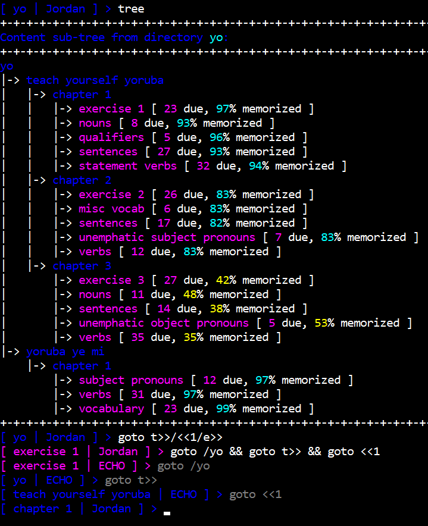
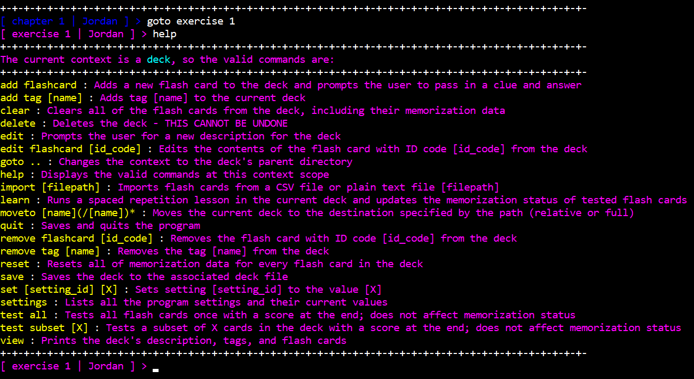
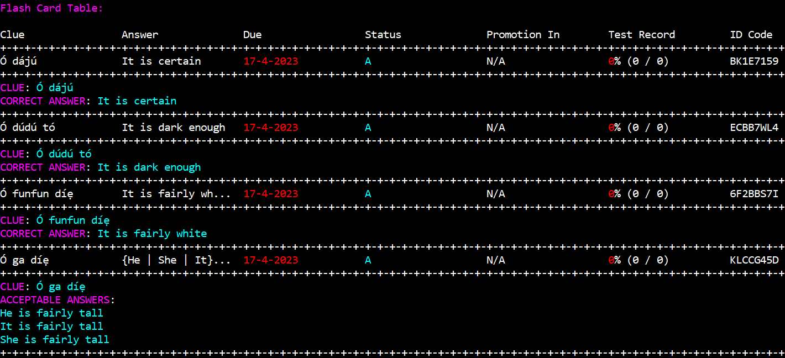
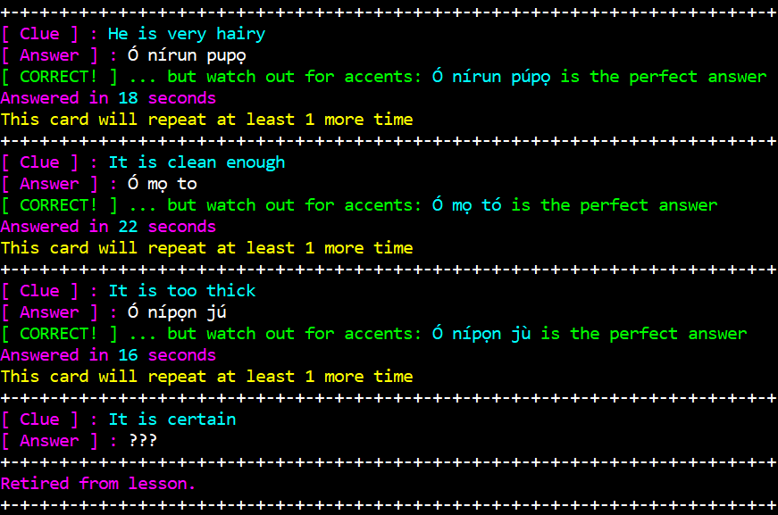
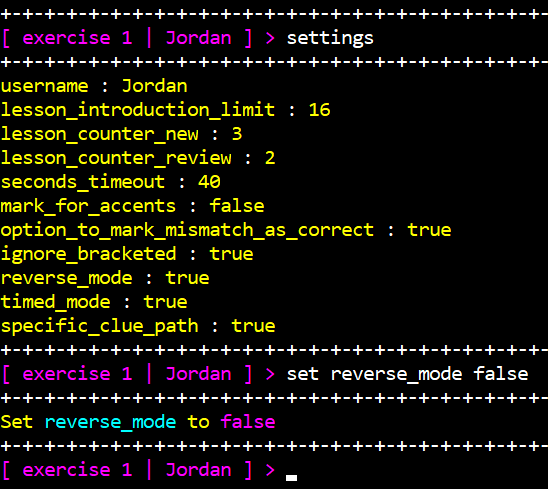

# Flash Fluency

## About
Flash Fluency is a flashcard program for spaced repetition memorization. 

## Status
Flash Fluency is still unfinished! It currently functions as a private tool that I use to learn languages.
I plan to extend it to include a GUI and to support image- and audio-based flashcards, similar to [ANKI](https://apps.ankiweb.net/).

That being said, I am quite content with the existing code, which is why this repository is public. Feel free to explore
and experiment with what's here!

## Media
Here are some screenshots from my own use of the program to learn [Yorùbá](https://en.wikipedia.org/wiki/Yoruba_language):
___

- Tree of directories and flash card decks accessible from `/yo`:  
- Navigation command `goto` featuring `>>` and `<<` autocompletion shorthand notation
___

List of valid commands when inside a flashcard deck (as opposed to a directory)
___

Partial table of flashcards in a particular deck, showing clues, valid answers, review due dates, memorization status of various overdue flashcards
___

Taken from a review lesson. In this state, the program was set to be lenient towards improper accent placement.
Providing the answer `???` will end the lesson and not affect the status of flashcards that were not reviewed.
___

The program has various settings to customize the learning experience. Some of these can be overridden with deck tags.
For example, adding the tag `irreversible` to a deck will set `reverse_mode` to `false` when a lesson or test is taken in that deck.
